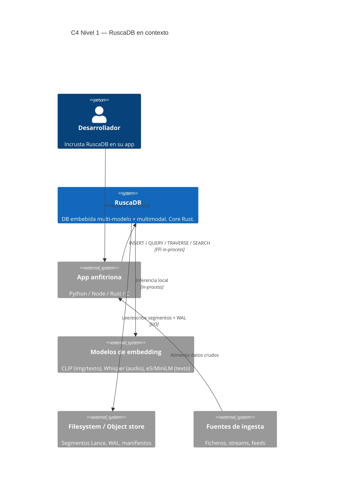
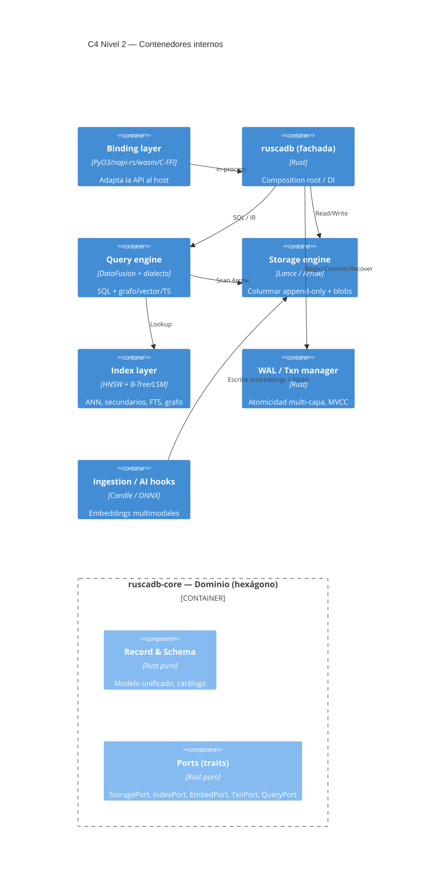
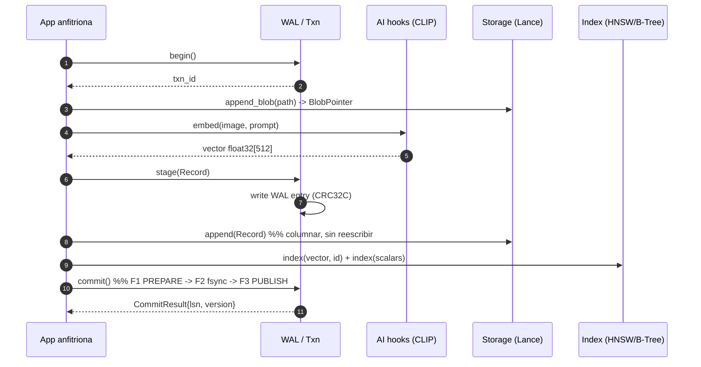

# RuscaDB — Hoja de Ruta de Diseño (v1.0)

> Base de datos **embebida (in-process)**, **multi-modelo** (relacional, documentos,
> grafos, vectores, time-series) y **multimodal** (imágenes, audio, video, texto).
> Core en **Rust**. Metodología **SDD/SDAD + TDD adversarial + mutation testing**.
>
> Este documento es la **fuente de verdad de diseño** (spec-first): el código se
> deriva de aquí. Identificadores en inglés; documentación en español.

---

## 0. Resumen ejecutivo

RuscaDB es «SQLite pero para IA, grafos y multimedia»: se enlaza **dentro del
proceso** de la aplicación anfitriona (sin servidor, sin red, sin daemon) y
expone **un solo directorio de base de datos** que almacena y consulta los cinco
modelos con un único lenguaje (SQL extendido tipo SurrealQL).

**Postura por defecto (tradeoffs aceptados):**

- **Durabilidad sin servidor** (WAL global + group commit) por encima de la
  latencia p50 pura.
- **Recall vectorial** (HNSW + PQ con filtrado híbrido iFVS) por encima del
  footprint mínimo.
- **Seguridad release-blocking**: no se libera un MVP que procese archivos de
  terceros sin el modelo de amenazas y la política de `unsafe` de §6.

**Stack frontier 2026 (veredictos únicos, §3 y §4):** Apache Arrow + **Lance**
(columnar multimodal), **Apache DataFusion** (query engine), **HNSW/IVF**
(vectorial), **Candle/ONNX** (embeddings locales), WAL propio + **MVCC**,
bindings PyO3 / napi-rs / wasm-bindgen / C-FFI.

**Garantía de calidad:** mutation score ≥ 70 % para merge y ≥ 85 % nightly,
0 pérdida de commits ack'd tras crash, recall@10 ≥ 0.95.

---

## 1. Visión y alcance

### 1.1 Objetivo

Construir un motor de datos embebido que unifique, en un solo archivo/carpeta y
un solo query language, lo que hoy exige apilar 3–4 sistemas (SQLite +
Elasticsearch + Pinecone/Qdrant + Neo4j) y sincronizarlos a mano.

### 1.2 Dentro del alcance (IN)

- 5 modelos: relacional, documental (JSON), grafo, vectorial, time-series.
- Multimodal: blobs de imagen/audio/video + embeddings nativos.
- Transacciones ACID multi-capa, MVCC snapshot isolation.
- Índices: B+tree, JSON path, CSR de grafo, HNSW, full-text BM25.
- Bindings Python, Node.js, WASM y C-FFI.
- Inferencia local opcional (CLIP/Whisper/e5) para vectorizar en la ingesta.

### 1.3 Fuera del alcance (OUT)

- Entrenamiento de modelos. Servidor/replicación distribuida. Red.
- Serializabilidad estricta por defecto (SSI opcional a futuro).
- GPU cluster / multi-nodo (fase posterior al MVP).

### 1.4 No objetivos

- No reinventar el parser SQL: se extiende DataFusion (ADR-001).
- No inventar un formato columnar: se usa Lance/Arrow (ADR-002).
- No reimplementar RocksDB en C++: K/V en Rust nativo (ADR-003).

---

## 2. Metodología: SDD/SDAD + TDD adversarial + mutation

> Canon: SDAD (arXiv:2608.20341), AdverTest (arXiv:2602.08146), MutGen
> (arXiv:2506.02954). Skills: `atdd-spec`, `agent-rigor`, `rust-lang`,
> `architecture`, `security-audit`.

### 2.1 Ciclo Spec → Test → Code → Refactor (SDAD)

```
intent capture → specs/<feature>.md (machine-readable) → agentic synthesis
   → 3 verification agents independientes → human sign-off → merge
```

| Fase | Entrada | Salida | Gate |
|---|---|---|---|
| 1. Intent capture | issue/pitch del PM | borrador de spec | — |
| 2. Spec machine-readable | borrador | YAML + FR/NF + AC + exit + rollback | **G0** humano aprueba spec |
| 3. Agentic synthesis | spec + `failing_test` (RED) | diff de implementación | **G1** RED real (falla por assert) |
| 4. Verificación multi-agente | diff + spec | 3 veredictos | **G2** spec-conformance + adversarial + security |
| 5. Human sign-off | evidencia agregada | merge | **G3** T1+T2 verde + trazabilidad |

**Regla de oro:** nada entra a `main` sin T1 verde ∧ T2 verde ∧ spec trazada ∧
0 mutantes vivos reales en el diff ∧ `unsafe` con `// SAFETY:`.

### 2.2 Artefacto `specs/<feature>.md`

```yaml
---
id: SPEC-0012
feature: wal_durability
status: accepted              # draft|accepted|implemented|verified|rolled_back
owner: storage-team
appetite_days: 10             # Shape Up: tiempo fijo, scope variable
boundaries:
  crates: [ruscadb-storage, ruscadb-core]
  out_of_scope: [network, bindings]
fr:
  - { id: FR-0012-01, desc: "cada COMMIT emite un registro WAL con CRC32C" }
  - { id: FR-0012-02, desc: "fsync obligatorio antes de ack al caller" }
nf:
  - { id: NF-0012-01, desc: "commit P99 < 5 ms en NVMe" }
  - { id: NF-0012-02, desc: "recovery < 1 s por GB de WAL" }
acceptance_criteria:
  - id: AC-0012-01
    given: una base con un COMMIT confirmado
    when: el proceso es terminado con SIGKILL
    then: al reopen, la fila existe y su checksum valida
    test: test_ac_0012_01_wal_durability_after_sigkill
  - id: AC-0012-02
    given: un WAL con un registro truncado
    when: se invoca recovery
    then: el registro se descarta sin corromper el prefijo válido
    test: test_ac_0012_02_wal_recovery_truncated_tail
exit_criteria:
  - nextest --workspace verde
  - mutation score del diff >= 70%
  - T2 spec_fidelity >= 0.90
rollback:
  - flag RUSCADB_FF_WAL_V2=0
  - down-migration en specs/migrations/0012_down.md
sandbox:
  - cargo nextest run -p ruscadb-storage
---
```

Reglas: **1 AC = 1 criterio atómico** (sin «y/o»), cada AC tiene test nominal y
anotación `#[test] // @spec AC-xxxx`, `exit_criteria` con umbrales numéricos,
`rollback` obligatorio (SBX).

### 2.3 Contrato ejecutable (`skill_contract`)

La spec se compila a un contrato JSON con pre/postcondiciones y `failing_test`.
El harness **rechaza la fase** si: (1) el `failing_test` no existe; (2) ya pasa
en el estado base (test decorativo, no hay RED); (3) tras la síntesis alguna
postcondición no se cumple (bloqueo False-DONE / SPE).

### 2.4 TDD adversarial (AdverTest) aplicado a Rust

```
 T-generator (LLM)  ──tests──►  cargo-mutants (M-generator)  ──survivors──►
      ▲                                                              │
      └────────── MutGen: inyecta diff de survivors en el prompt ◄───┘
```

- **T-generator** escribe/endurece tests contra los huecos.
- **M-generator** (`cargo-mutants` v27.x) genera mutantes context-aware con
  `--in-diff --shard k/n --in-place --baseline=skip`.
- Los **supervivientes son señal**: se clasifican (equivalente / falta de assert
  / falta de branch / oráculo débil / dead code) y se realimentan (MutGen).
- Objetivo de mejora: **+8–9 pp de mutation score por ciclo** de endurecimiento.

### 2.5 Métricas SDAD

| Métrica | Definición | Objetivo |
|---|---|---|
| Ambiguity Tax | horas de rework por ambigüedad / total | < 5 % |
| Spec Fidelity | AC implementados conforme a texto / total (LLM-judge) | ≥ 0.90 |
| SER (Spec Execution Rate) | AC que pasan / total | 1.00 antes de sign-off |
| TCI_agentic | tareas sin intervención humana / intentadas | ≥ 0.80 (trend ↑) |

---

## 3. Investigación de frontera (RSF/FRS) — evidencia

| Tema | Hallazgo clave 2026 | Fuente | Decisión que motiva |
|---|---|---|---|
| SDD agéntico | El SDLC se reestructura: la disciplina se **relocaliza upstream** (specs precisas + gates + provenance); Fidelity/SER/TCI_agentic como gobernanza | SDAD, arXiv:2608.20341 | Adoptar §2 |
| TDD adversarial | Agente de tests vs agente de mutantes con feedback bidireccional: +8.56 % fault-detection, +63 % vs EvoSuite | AdverTest, arXiv:2602.08146 | Adoptar §2.4 y §5 |
| Test-gen guiada por mutación | Inyectar diffs de mutantes vivos en el prompt maximiza mutation score | MutGen, arXiv:2506.02954 | Realimentar survivors |
| Filtrado vectorial (FVS) | Ninguna estrategia (pre/post/in) domina; iFVS elige por selectividad y gana en QPS-recall | iFVS, arXiv:2607.22922 | FVS híbrida §4.4 |
| HNSW + PCA | Reducir dimensionalidad con PCA acelera la búsqueda antes del cómputo exacto | pHNSW, ASP-DAC'26 | Refinamiento opcional |
| Query engine | DataFusion es el motor SQL extensible en Rust con Arrow nativo; usado por Lance, InfluxDB, etc. | datafusion.apache.org | ADR-001 |
| Columnar multimodal | Lance: append de columnas sin reescribir, zero-copy, blobs grandes, versionado | lancedb.com | ADR-002 |
| Multi-modelo + SurrealQL | Grafos y vectores como records en un solo motor; `->edge->` y `embedding <|k|>` en una query | surrealdb.com | ADR-007 |
| WAL en Rust | WAL user-space a ~IOPS del dispositivo; CRC32C + torn-write recovery + group commit | arXiv:2507.13062 | ADR-006, §4.2 |
| Mutación Rust | `cargo-mutants` v27.1.0 (sharding, `--in-place`, `--in-diff`) | mutants.rs | CI §5 |
| PBT Rust | `proptest` 1.11 (estrategias explícitas + shrinking) | docs.rs/proptest | §5 |
| Embeddings multimodales | CLIP (img/texto), Whisper (audio→texto), MiniLM/e5 (texto); preferir `safetensors` | HF / Oracle 26 | ADR-005, §6 |

---

## 4. Arquitectura

### 4.1 Vista C4 — Nivel 1 (Contexto)



**Frontera:** RuscaDB posee almacenamiento, indexación, planificación y
transacción. **No** posee entrenamiento, red ni servidor. La inferencia es una
dependencia **opcional** (feature `ai`).

### 4.2 Vista C4 — Nivel 2 (Contenedores)



### 4.3 Workspace Cargo y dependencias (hexagonal)

```mermaid
graph TD
    core[ruscadb-core]
    storage[ruscadb-storage] --> core
    query[ruscadb-query] --> core
    vector[ruscadb-vector] --> core
    graph[ruscadb-graph] --> core
    multi[ruscadb-multimodal] --> core
    ai[ruscadb-ai] --> core
    wal[ruscadb-wal] --> core
    ffi[ruscadb-ffi] --> core
    py[ruscadb-py] --> ffi
    node[ruscadb-node] --> ffi
    facade[ruscadb fachada] --> storage & query & vector & graph & multi & ai & wal & core
    testkit[ruscadb-testkit] --> core
```

**Regla de oro:** las flechas apuntan **siempre hacia `ruscadb-core`**. El core
**no** conoce `lance`, `datafusion`, `candle` ni PyO3.

```
ruscadb/
├── Cargo.toml                 # [workspace] resolver = "2"
├── crates/
│   ├── ruscadb-core/          # dominio, ports, Record, catálogo, IR
│   ├── ruscadb-storage/       # Lance/Arrow (StoragePort)
│   ├── ruscadb-query/         # DataFusion + dialecto (QueryPort)
│   ├── ruscadb-vector/        # HNSW/IVF + filtering dinámico (IndexPort)
│   ├── ruscadb-graph/         # edges, traversal (B-Tree/LSM)
│   ├── ruscadb-multimodal/    # blobs, chunking, orquestación
│   ├── ruscadb-ai/            # Candle/ONNX (EmbedPort)
│   ├── ruscadb-wal/           # WAL + MVCC (TxnPort)
│   ├── ruscadb-ffi/           # C ABI estable
│   ├── ruscadb-py/            # PyO3
│   ├── ruscadb-node/          # napi-rs
│   ├── ruscadb/               # fachada (composition root)
│   └── ruscadb-testkit/       # PBT, oráculos, mutantes, fixtures
└── specs/                     # specs SDD machine-readable (pre-código)
```

### 4.4 Modelo de datos unificado — el `Record`

Un **solo** `Record` físico; cada modelo es una **proyección** sobre los mismos
campos.

```rust
/// Registro universal de RuscaDB: un solo tipo físico para los 5 modelos.
#[derive(Clone, Debug, PartialEq)]
pub struct Record {
    /// Identidad estable (ULID): string ordenable por tiempo.
    pub id: RecordId,
    /// Escalares tipados: PK, columnas relacionales, timestamp (time-series).
    pub scalars: ScalarMap,
    /// Documento: payload JSON anidado y libre (modelo documental).
    pub doc: Option<JsonValue>,
    /// Grafo: aristas entrantes/salientes (modelo de grafo).
    pub edges: EdgeSet,
    /// Vector de embeddings: float32[d] (modelo vectorial).
    pub vector: Option<Embedding>,
    /// Blob multimodal: puntero a bytes (modelo multimodal).
    pub blob: Option<BlobPointer>,
    /// Versión MVCC + procedencia del embedding.
    pub meta: RecordMeta,
}
```

| Modelo | Proyección del Record | Índice que la sirve |
|---|---|---|
| Relacional | `scalars` + `id` como PK | B+tree / primary |
| Documentos | `doc` (JSON anidado) | índice secundario sobre path |
| Grafos | `edges` (`in`/`out`) + `id` nodo | aristas + traversal CSR |
| Vectores | `vector: float32[d]` | HNSW (ANN) |
| Time-series | `scalars["ts"]` append-only | partición temporal en Lance |
| Multimodal | `blob` (pointer) + `vector` | blob store CAS + HNSW |

Una tabla Lance = conjunto de `Record` con el **mismo esquema Arrow**
(`scalars` struct, `doc` Utf8/JSON, `edges` `List<Struct>`, `vector`
`FixedSizeList<Float32,d>`, `blob` `Struct{uri,offset,len,media_type}`). **Un
storage, cinco índices.** `RecordMeta.embedding_version` habilita versionado
(ADR-009).

### 4.5 Flujo de un INSERT multimodal



**Invariante:** el `Record` es visible solo tras `commit`, cuando (1) el WAL
está fsync, (2) el segmento Lance está escrito, y (3) el **manifiesto** (MVCC)
apunta a la nueva versión. Todo lo demás es recuperable por replay del WAL.

### 4.6 ADRs iniciales (veredicto único + tradeoff)

| ID | Decisión | Alternativas | Tradeoff |
|---|---|---|---|
| ADR-001 | **DataFusion** + un dialecto extendido (superset SurrealQL) | parser propio; SQLite VDBE; DuckDB | +planner maduro, Arrow nativo; −acoplamiento al calendario de DataFusion |
| ADR-002 | **Lance** como formato físico y de blobs | Parquet puro; Arrow IPC; JSONL | +append sin reescritura, zero-copy, blobs; −ecosistema más joven |
| ADR-003 | K/V y catálogo en **Rust nativo** (`redb` B-Tree + capa LSM); sin RocksDB | RocksDB (C++); sled; LMDB | +sin C++, build reproducible; −RocksDB más maduro en write-heavy |
| ADR-004 | **HNSW** primario; IVF+PQ fallback; FVS híbrida iFVS | IVF-PQ puro; DiskANN; brute-force | +recall/latencia; −RAM y borrado costoso (tombstones) |
| ADR-005 | **Candle** por defecto; feature `onnx` opcional | ONNX Runtime; libtorch; servicio remoto | +portabilidad WASM, sin C++; −menos kernels GPU que ONNX |
| ADR-006 | **WAL lógico global** + **MVCC** por manifiesto | WAL por índice; tx ligeras Lance; sin WAL | +recuperación consistente; −punto de serialización global (mitigado con group commit) |
| ADR-007 | Un lenguaje: SQL + extensiones (`->`, `@>`, `TRAVERSE`, `KNN`, `TS`) | DSL binaria; JSON query; SurrealQL completo | +una curva, tooling SQL; −versionar la sintaxis extendida |
| ADR-008 | **Zero-copy** en la frontera (Arrow C Data Interface) | marshalling por copia; JSON en frontera | +rendimiento/memoria; −contrato ABI de Arrow |
| ADR-009 | **Versionado de embeddings** (`model_id`+dim); índice por versión | reembedding destructivo; columna por modelo | +migración incremental; −espacio y varios índices |
| ADR-010 | Directorio auto-descriptivo (`manifest.json`+`data/`+`wal/`+`index/`+`blobs/`) | archivo único monolítico | +paralelismo/recovery por partes; −no es «un solo fichero» (empaquetado opcional) |
| ADR-011 | C-ABI estable (`ruscadb-ffi`) + drivers finos | reimplementar por lenguaje; gRPC | +un core; −herencia de límites del ABI C |
| ADR-012 | API síncrona + `rayon`; `tokio` solo para I/O interno | async-first; threads puros | +API simple para embebido; −menos orquestación async fina |

### 4.7 Fitness functions arquitectónicas (CI T1)

| ID | Regla | Verificación | Umbral | Sev |
|---|---|---|---|---|
| FF-01 | Sin ciclos entre crates | test sobre `cargo metadata` | 0 ciclos | 🔴 |
| FF-02 | Dominio sin infra (`core` no importa adapters) | grafo de imports | 0 aristas salientes | 🔴 |
| FF-03 | Puertos antes que adapters | contrato en `testkit` | 100 % ports implementados | 🔴 |
| FF-04 | `unsafe` acotado y justificado | `#![forbid(unsafe_code)]` en core; clippy | 0 unsafe en core; 100 % con `// SAFETY:` | 🔴 |
| FF-05 | Tamaño de módulo | `tokei` | ≤ 500 LOC (warn) / 800 (block) | 🟡 |
| FF-06 | Tamaño/complejidad de función | clippy | ≤ 60 LOC, complejidad < 10 | 🟡 |
| FF-07 | Tipos/docs en API pública | clippy `missing_docs` | 0 items sin doc/tipo | 🟡 |
| FF-08 | Mutation score | `cargo-mutants` | ≥ 70 % (merge) / ≥ 85 % (nightly) | 🔴 |
| FF-09 | Zero-copy en frontera | test de contrato | 0 copias en ruta caliente | 🟡 |
| FF-10 | Presupuesto de dependencias | `cargo-deny` | 0 HIGH/CRITICAL; 1 versión/crate | 🔴 |
| FF-11 | Contratos SDD presentes | `specs/*.md` | 100 % features con spec | 🟡 |
| FF-12 | Recovery obligatorio | crash-replay del WAL | 0 pérdidas; estado == pre-crash | 🔴 |

---

## 5. Storage Engine y gestión transaccional

### 5.1 Decisiones de frontera

| # | Decisión | Veredicto | Tradeoff |
|---|---|---|---|
| D1 | Formato | **Lance + Arrow (zero-copy)** | +append columnas, lectura selectiva de blobs; −ecosistema joven |
| D2 | Query engine | **DataFusion in-process** | +planner maduro; −compilación pesada |
| D3 | Metadatos/grafo/FTS | **redb (B-tree) + LSM** | +escritura secuencial; −read amplification |
| D4 | Vectorial | **HNSW + PQ/rabitQ opcional** | +recall; −RAM y build |
| D5 | FVS | **híbrido por selectividad + iFVS** | +QPS-recall; −complejidad de codebooks |
| D6 | Durabilidad | **WAL global + group commit** | +throughput (~29× @ c=64); −p50 sube al agrupar |
| D7 | Concurrencia | **MVCC snapshot isolation** | +lecturas sin lock; −GC/bloat |
| D8 | Memoria | **buffer pool LRU-K + budget duro** | +control de footprint; −misses si budget bajo |
| D9 | Compresión | **ZSTD por bloque + page 4 KiB** | +ratio 3–8×; −CPU en caliente |
| D10 | Blobs | **CAS por hash + refcount** | +dedup, fuera del buffer pool; −GC referencial |

### 5.2 Layout en disco

```
ruscadb.db/
├── MANIFEST.json          # entrypoint versionado (schema_version, epoch, punteros)
├── CATALOG/catalog.rdb    # map object_id -> descriptor + schema
├── WAL/wal.log            # append-only, frames CRC32C, tx_id LSN
├── DATA/<table>/          # segmentos Lance (*.lance + _versions/)
├── META/graph|fts|kv/     # CSR, inverted index BM25, LSM tiers
├── BLOBS/ab/cd/<sha>.blob # CAS sharding 2 niveles + refs/
├── SCHEMA/v0001..vN.json  # migraciones versionadas
└── LOCK                   # lock exclusivo (single-writer embebido)
```

El **manifiesto** es la fuente de verdad atómica (escritura `tmp+fsync+rename`).
Cada `schema_version` es una migración inmutable; `add column` es
metadata-only con backfill lazy.

### 5.3 Protocolo ACID multi-capa

```
BEGIN ──► tx_id = alloc()  (snapshot = checkpoint_lsn + in-flight set)
  ├─ 1. DML bufferizado en memtables privadas (no toca disco)
  ├─ 2. Blobs: write a CAS (idempotente por hash)
  ├─ 3. Vectores: append a staging Lance fragment (no visible)
  ├─ 4. Metadatos/grafo/FTS: delta privado
  └─ COMMIT (atómico):
       F1 PREPARE  → commit record en WAL: {tx_id, ops, blob_hashes, frag_ids, kv_deltas}
       F2 fsync(group) → durable (group commit)
       F3 PUBLISH  → aplica a estructuras visibles + bump MANIFEST.epoch (rename atómico)
       F4 ack
```

- **Atomicidad cross-capa:** el WAL escribe *punteros* (hash/frag_id), nunca el
  blob. F3 publica el nuevo `epoch` que referencia fragments y blobs; un commit
  a medias (< F3) no es visible.
- **WAL global único:** elimina el WAL interno de la LSM (sin 2PC entre WALs).
- **Durabilidad configurable:** `Always` / `GroupCommit` (default) / `OsBuffered`.

**Frame WAL:** `[ len u32 | lsn u64 | tx_id u64 | kind u8 | payload | crc32c u32 ]`.
Torn write = primer frame con CRC inválido → **truncar** al último válido (nunca
reparar). Recovery = replay idempotente desde `checkpoint_lsn`.

**MVCC:** cada versión `{created_tx, deleted_tx|NULL, lsn}`; visibilidad por
`tx_id`; write-write = first-committer-wins (SI, no serializable por defecto);
reaper por `low_watermark_tx`.

**Invariante SI-1:** todo commit ack'd (F4) es recuperable tras crash,
exactamente con sus blobs, vectores y metadatos; ningún commit no-ack'd es
visible.

### 5.4 Índices por modelo y FVS

| Modelo | Estructura | Parámetros | Tradeoff |
|---|---|---|---|
| Relacional | B+tree | page 4 KiB | orden/range; −write in-place |
| Documento | JSON path index | paths declarativos | `doc.tags[*]`; −no declarado = scan |
| Grafo | CSR + delta LSM | offsets u32/u64 | traversal cache-friendly; −compaction |
| Vector | HNSW (+PQ) | `M=32`, `efC=200`, `efS=64–256` | recall ~0.95–0.99; −RAM ∝ N·M·dim·4B |
| Full-text | inverted + BM25 | k1=1.2, b=0.75 | ranking híbrido; −postings grandes |
| Blob | CAS sha256 + refcount | sharding `ab/cd/` | dedup; −GC transaccional |

**FVS por selectividad `s`:** `s ≥ 0.6` → post-filtering; `0.05 ≤ s < 0.6` →
iFVS; `s < 0.05` → pre-filtering; refinamiento PCA (pHNSW) antes del cómputo
exacto.

### 5.5 Traits clave (firmas Rust + invariantes)

```rust
/// Punto de entrada del motor de almacenamiento.
/// # Invariantes
/// - I1: toda lectura fuera de transacción usa el último snapshot publicado.
/// - I2: `begin` nunca bloquea a lectores; writers serializados por TxnManager.
/// - I3: si `commit` devuelve Ok, el efecto es durable y visible (SI-1).
pub trait StorageEngine: Send + Sync {
    type Txn: TxnManager;
    /// Abre/crea la base, valida manifiesto y ejecuta recovery del WAL.
    /// Errors: [`RuscaError::CorruptManifest`], [`RuscaError::WalRecoveryFailed`].
    fn open(path: &std::path::Path, config: &EngineConfig) -> Result<Self, RuscaError>
    where Self: Sized;
    /// Inicia una transacción con aislamiento snapshot.
    fn begin(&self, isolation: Isolation) -> Result<Self::Txn, RuscaError>;
    /// Cierra limpio: checkpoint + truncado de WAL + release del lock.
    fn close(self) -> Result<(), RuscaError>;
}

/// Gestor transaccional multi-capa (orquesta blob/vector/metadatos).
/// # Invariantes
/// - I1: `commit` es atómico cross-capa (F1–F3); nunca expone estado parcial.
/// - I2: group commit coalesce fsyncs sin perder durabilidad.
/// - I3: un `tx_id` es único y monótono creciente; nunca se reutiliza.
pub trait TxnManager {
    /// Bufferea una mutación sin publicar. No toca disco.
    fn stage(&mut self, op: Mutation) -> Result<(), RuscaError>;
    /// Read-your-writes: lee del snapshot + delta privado.
    fn get(&self, key: &Key) -> Result<Option<Value>, RuscaError>;
    /// Commit en 2 fases (PREPARE → PUBLISH) con WAL global.
    fn commit(self) -> Result<TxId, RuscaError>;
    /// Aborta y libera recursos (blobs staging sin ref, fragments no publicados).
    fn rollback(self) -> Result<(), RuscaError>;
}

/// Índice vectorial ANN (HNSW + cuantización opcional).
/// # Invariantes
/// - I1: `search` solo devuelve candidatos visibles para el snapshot.
/// - I2: la metadata (`model_id`,`dim`,`metric`) debe coincidir con la query.
/// - I3: `insert` es idempotente por `VectorId`; reinsertar actualiza la versión.
pub trait VectorIndex: Send + Sync {
    type Id: Copy + Eq + std::hash::Hash;
    fn build(params: &HnswParams, metric: Metric) -> Result<Self, RuscaError>
    where Self: Sized;
    fn search(&self, query: &[f32], k: usize, ef_search: usize, filter: Option<&Filter>)
        -> Result<Vec<(Self::Id, f32)>, RuscaError>;
    fn insert(&self, id: Self::Id, vector: &[f32], meta: EmbeddingMeta) -> Result<(), RuscaError>;
}

/// Almacén de grafo (adyacencia CSR + traversal).
/// # Invariantes
/// - I1: las aristas respetan el snapshot MVCC (sin aristas huérfanas).
/// - I2: un traversal tiene profundidad/límite superior (protección de RAM).
pub trait GraphStore: Send + Sync {
    fn neighbors(&self, node: NodeId, snapshot_lsn: Lsn) -> Result<Vec<Edge>, RuscaError>;
    fn traverse(&self, start: NodeId, dir: Direction, max_depth: u16, max_nodes: usize)
        -> Result<Vec<NodeId>, RuscaError>;
}

/// Blob store content-addressed para multimodal.
/// # Invariantes
/// - I1: `put` es idempotente (mismo contenido ⇒ mismo hash, dedup).
/// - I2: todo blob referenciado por un commit durable tiene `refcount >= 1`.
/// - I3: los blobs grandes NO entran al buffer pool (streaming directo).
pub trait BlobStore: Send + Sync {
    fn put(&self, bytes: &[u8]) -> Result<BlobHash, RuscaError>;
    fn get_range(&self, hash: &BlobHash, range: Range<u64>) -> Result<Vec<u8>, RuscaError>;
    fn unref(&self, hash: &BlobHash, tx_id: TxId) -> Result<(), RuscaError>;
}

/// Write-Ahead Log global: durabilidad y recovery.
/// # Invariantes
/// - I1: el WAL se escribe (CRC32C) y fsync'ea ANTES de publicar el manifiesto.
/// - I2: `replay` desde `checkpoint_lsn` es idempotente y determinista.
/// - I3: una cola rasgada se trunca al último frame CRC-válido (nunca se repara).
pub trait Wal: Send + Sync {
    fn append(&self, tx_id: TxId, record: &CommitRecord) -> Result<Lsn, RuscaError>;
    fn sync_group(&self, through: Lsn) -> Result<(), RuscaError>;
    fn recover(&self, checkpoint_lsn: Lsn) -> Result<Lsn, RuscaError>;
}
```

### 5.6 Memoria, compresión y escalado

- **Buffer pool** 4 KiB, **LRU-K (K=2)** (o LFU con aging para scan-heavy);
  **presupuesto RAM duro** `memory_budget_bytes` (default `min(25 % RAM, 2 GiB)`).
- **Zero-copy** Arrow/Lance sobre mmap; `MADV_SEQUENTIAL` en scans,
  `MADV_RANDOM` en lookups.
- **Vectores:** grafo HNSW en RAM; si `N·M·4B` excede el budget → PQ/rabitQ o
  IVF en disco. **Blobs:** streaming directo, 0 participación en el pool.
- **ZSTD por bloque** (nivel 3 caliente / 9 frío); page 4 KiB; bloques Lance
  64–256 KiB. **Backpressure** vía group-commit batch (no OOM).

| Escala | Estrategia dominante |
|---|---|
| MB | todo en RAM, 1 segmento, cero compaction |
| GB | LSM activo, LRU-K, HNSW en RAM, compaction tiered |
| 100 GB | mmap columnar, HNSW+PQ, GC MVCC, checkpoint |
| TB | sharding por tabla, IVF-en-disco, blobs fuera, leveled compaction |

**Benchmarks objetivo (metas, no promesas):** point read p50/p95/p99 (GB:
50 µs / 300 µs / 1.5 ms), recall@10 ≥ 0.97, write QPS c=64 ≥ 8k (GB), blob
ingest ≥ 500 MB/s, overhead ≤ 1.5×. Baseline honesto: medir `fdatasync` del
host primero (p. ej. ~878 µs ⇒ techo ≈ 1.140 writes/s sin group commit).

---

## 6. Seguridad y hardening

> DB **in-process**: sin frontera de proceso. Un fallo de memoria en FFI, parser,
> HNSW o deserialización es un fallo de la **app anfitriona** (RCE/corrupción).

### 6.1 Veredicto

**RuscaDB es aprobable para MVP embebido solo si estos controles son
release-blocking.** «Seguro por estar en Rust» es falso: `unsafe` (FFI, HNSW,
mmap), deserialización Arrow/ONNX y el parser son la superficie real.

### 6.2 Modelo de amenazas STRIDE

| Componente | Amenaza | Ejemplo | Mitigación |
|---|---|---|---|
| Query parser | Inyección | interpolar input en WHERE | AST tipado + queries parametrizadas + allowlist de identificadores |
| Query parser | DoS | `OR` anidado, regex catastrófica | complexity budget, regex lineal `size_limit`, límites de profundidad/timeout |
| Query parser | Elevación | `file()`, `http::get()` | capabilities `file/net/script/embed` **off por defecto** |
| Blob/Arrow deser | RCE | Parquet/IPC malformado | validar lengths/offsets, no mmap de archivos no confiables, fuzz continuo |
| HNSW (unsafe) | OOB | lista de vecinos corrupta | invariantes `debug_assert`, no `get_unchecked` sin SAFETY, miri+fuzz |
| WAL | Torn write/tampering | crash mid-frame, edición | CRC32C por frame, fsync atómico, truncar/rechazar |
| FFI | UAF/UB | `len` incorrecto, doble free | `#[repr(C)]`, validar `(ptr,len)`, `catch_unwind`, handle table con generación |
| Supply chain | tampering | crate/`build.rs` malicioso | cargo-audit + deny + vet, lockfile, registries allowlist |
| Modelos | RCE/integrity | `.onnx` malicioso | preferir `safetensors`, op-set restringido, hash+firma, shapes límite |

### 6.3 Política de `unsafe`

```toml
[lints.rust]
unsafe_op_in_unsafe_fn = "deny"
unsafe_code            = "deny"   # solo crates designados lo habilitan
[lints.clippy]
undocumented_unsafe_blocks    = "deny"
missing_safety_doc            = "deny"
multiple_unsafe_ops_per_block = "deny"
```

Cada bloque `unsafe` lleva `// SAFETY:`; allowlist versionada
(`unsafe-allowlist.toml`) con conteo por crate; `cargo-geiger`, `miri`,
ASan/UBSan en CI. Ningún `unsafe` nuevo sin SAFETY + test/fuzz + revisión de un
segundo ingeniero.

### 6.4 Límites de recursos (defaults seguros)

| Recurso | Límite default | Enforcement |
|---|---|---|
| Profundidad AST / recursión | 64 | guard clause + trampoline |
| Query complexity budget | 100 000 unidades | planner rechaza antes de ejecutar |
| Timeout de query | 5 000 ms | deadline cooperativo + cancel token |
| `LIMIT` implícito | 1 000 filas | planner inyecta si falta |
| Blob | 256 MiB; cuota total | rechazo temprano |
| Traversal grafo | depth 16 / fan-out 10 000 | corte + error |
| Dimensión vector | ≤ 4 096 | validación en INSERT/build |
| Memoria del proceso | budget vía `GlobalAlloc` cap | rechazo `ResourceLimit` |
| Regex | `size_limit` 1 MiB | crate `regex` lineal |

Path safety: `file()` solo dentro de *sandbox root* (canonicalizar + prefijo;
anti `..`/symlink). Anti-amplificación: ZSTD con límite de ratio (anti zip-bomb).

### 6.5 Datos en reposo y supply chain

- **Cifrado opcional** AEAD XChaCha20-Poly1305 / AES-256-GCM; passphrase →
  Argon2id → DEK; KEK en OS keychain; `secrecy`+`zeroize`.
- **Integridad:** CRC32C (WAL) + BLAKE3 (páginas/manifiesto).
- **Supply chain:** `Cargo.lock --locked`, `cargo-audit`, `cargo-deny`
  (advisories/licenses/bans/sources), `cargo-vet`, toolchain pinneada, SBOM
  CycloneDX por release, `gitleaks` pre-commit.
- **Checklist OWASP** mapeado (A01–A10) y gates pre-commit (§2.1).

**Exit criteria de seguridad (bloqueantes):** T1+T2 verdes; fuzz sin crash 7
días; SBOM + `cargo vet --locked` limpios; 0 `unsafe` sin SAFETY.

---

## 7. Estrategia de verificación y calidad

### 7.1 Gates T1/T2/T3

**T1 — determinista (<90 s, bloquea merge):** `cargo fmt --check`, `clippy -D
warnings`, `nextest` (unit + fast integration), doctests, `xtask trace`, unsafe
audit (`geiger` ≤ 2/1k LOC), `cargo deny && cargo audit`, `insta --check`.

**T2 — LLM-judge (<10 min, bloquea merge):** Spec Fidelity ≥ 0.90, behavioural
spec (pre/post), adversarial review (0 HIGH abiertos), mutantes in-diff
(`cargo mutants --in-diff` MS ≥ 70 %), judge `repeat:3 temp=0` majority ≥ 2/3.

**T3 — regression nightly (<60 min, alert-only):** mutation full MS ≥ 85 %
(32 shards), PBT 10 000 casos, crash recovery 10k fault points, differential
parity ≥ 99.9 %, fuzzing 3600 s, loom, miri, criterion P95 ≤ +5 %,
cross-platform (Win/Linux/macOS × stable/MSRV).

```
MERGE  ⇔  T1 verde ∧ T2 verde ∧ spec trazada ∧ 0 survivors reales en diff
          ∧ MS_diff ≥ 70% ∧ unsafe justificado
T3 falla ⇒ issue blocking (+ rollback si toca durabilidad)
CFR > 5% o corrupción escapada ⇒ congelar merges + postmortem blameless
```

### 7.2 Matriz de tests por capa

| Capa | Qué valida | Herramienta |
|---|---|---|
| Unit | contratos de módulo, BVA | `nextest` |
| Property-based | invariantes storage/query | `proptest 1.11` |
| Integration ACID | commit/rollback, aislamiento, WAL | `nextest` + `fail` |
| Crash recovery | SIGKILL en cualquier punto, reabrir | fault points + proceso hijo |
| Differential | RuscaDB vs SQLite/DataFusion/DuckDB | `rusqlite`/`datafusion`/`duckdb` |
| Fuzzing | parser, WAL/CRC, blob, FFI, modelos | `cargo-fuzz` |
| Concurrency | WAL writer/reader, buffer pool | `loom` |
| UB/unsafe | layout, FFI, codecs, zero-copy | `miri` nightly |
| Snapshot | planes, ASTs, errores | `insta` |
| Benchmarks | throughput/latencia | `criterion` + `critcmp` |
| Recall vectorial | recall@k vs ground-truth | brute-force kNN |

**BVA por variable:** `min-1, min, min+1, max-1, max, max+1, 0, "", None, NaN,
overflow` sobre `page_id`, `lsn`, `dim`, `k`, `txn_id`, `blob_len`, `checksum`.
**Pairwise t=2** sobre `page_size × wal_sync × cache_policy × isolation`; subir a
**t=4** donde persistan supervivientes.

### 7.3 Invariantes verificables (PBT)

| # | Invariante | Propiedad | Template |
|---|---|---|---|
| I1 | Durabilidad tras crash | `commit ∧ crash ⇒ reopen ⇒ presente` | boundary + crash injection |
| I2 | Atomicidad COMMIT multi-capa | todo-o-nada entre capas | idempotent/atomic |
| I3 | Idempotencia de replay WAL | `replay(replay(w)) == replay(w)` | idempotent |
| I4 | Consistencia índice↔datos | `lookup(index,k) ⊆ scan(data)` ∧ viceversa | roundtrip |
| I5 | Recall HNSW ≥ objetivo | `recall@k(hnsw, exact) ≥ R` | metamorphic + estadístico |
| I6 | Roundtrip encode/decode blobs | `decode(encode(b)) == b` | roundtrip |
| I7 | Snapshot isolation sin dirty reads | `read(t2) ∌ write(t1)` hasta commit | isolation |
| I8 | Metamorphic de filtros | `f(x+k)==f(x)+k`; `reverse(reverse(x))==x` | metamorphic |
| I9 | Purity del planner | `plan(q)` determinista, 0 I/O | pure |
| I10 | CRC detecta corrupción | `flip_bit ⇒ Err` tipado, nunca panic/UB | boundary |

Invariante inválido ⇒ **se descarta** (Best-of-N), no se repara.

### 7.4 SLO de calidad

| SLO | Merge | Nightly |
|---|---|---|
| Line / branch coverage (core) | ≥ 80 % / ≥ 70 % | ≥ 90 % / ≥ 80 % |
| **Mutation score** | **≥ 70 %** | **≥ 85 %** |
| Flakiness rate | < 1 % | < 0.5 % |
| Differential parity | — | ≥ 99.9 % |
| Latencia P95 | ≤ +5 % | ≤ +5 % |
| HNSW recall@10 | — | ≥ 0.95 |
| Crash recovery pérdida | — | **0 registros** |
| CFR / MTTR corrupción | < 5 % | < 24 h |
| Unsafe budget | ≤ 2/1k LOC | ↓ |

### 7.5 Matriz de trazabilidad (extracto)

| Req | Spec/AC | Test | Cov (l/b) | MS | Gate |
|---|---|---|---|---|---|
| FR-0012-01 | AC-0012-01 | `test_ac_0012_01_wal_durability_after_sigkill` | 92/78 | 83 % | T1+T2 ✅ |
| FR-0012-02 | AC-0012-02 | `test_ac_0012_02_wal_recovery_truncated_tail` | 88/74 | 74 % | T2 ✅ |
| FR-0013-01 | AC-0013-01 | `test_ac_0013_01_hnsw_recall_at_10` | 90/70 | 71 % | T2 ✅ |
| (sin mapear) | — | — | — | — | **T1 ❌** |

---

## 8. Hoja de ruta por fases

| Fase | Objetivo | Entregables clave | Exit criteria |
|---|---|---|---|
| **F0 — Fundación** (sem 1–2) | Esqueleto y metodología | workspace Cargo, `specs/` template, `xtask trace`, CI T1, lints unsafe, `deny.toml`, `cargo-mutants` | T1 < 90 s; 100 % trazado; FF-01/02/04 verdes |
| **F1 — Storage/WAL** (mes 1–2) | Núcleo durable | `ruscadb-core` + `ruscadb-storage` + `ruscadb-wal`; manifiesto, WAL CRC32C, MVCC, buffer pool | I1–I4/I10; crash recovery 0 pérdida; MS ≥ 70 % |
| **F2 — Query engine** (mes 3) | Lenguaje de consulta | `ruscadb-query` con DataFusion + dialecto (`->`, `@>`, `TRAVERSE`, `KNN`), planner, EXPLAIN | differential vs SQLite/DataFusion ≥ 99.9 %; fuzz parser 0 crash |
| **F3 — Índices y grafos** (mes 3–4) | Acceso rápido | `ruscadb-vector` (HNSW+iFVS), `ruscadb-graph` (CSR), FTS BM25 | recall@10 ≥ 0.95; I4/I9; loom verde |
| **F4 — Multimodal/IA** (mes 4–5) | Ingesta vectorizada | `ruscadb-multimodal` + `ruscadb-ai` (Candle/ONNX), versionado de embeddings | I6 roundtrip 1.0; 0 UB en FFI; modelo no allowlisted ⇒ rechazo |
| **F5 — Bindings** (mes 5) | Interoperabilidad | `ruscadb-ffi` (handle table), `ruscadb-py`, `ruscadb-node`, WASM | 0 UB ASan/UBSan en suite FFI; SDK Python/Node funcional |
| **F6 — Hardening/Release** (mes 6) | Producción embebida | cifrado en reposo, SBOM, cross-platform, AdverTest continuo | MS ≥ 85 %; SLO §7.4 en verde sostenido; exit criteria §6.5 |

Cada fase se ejecuta **spec-first**: se escriben `specs/<feature>.md` + tests
RED antes de tocar código; el gate de fase es la matriz de trazabilidad
actualizada.

---

## 9. Registro de riesgos técnicos

| ID | Riesgo | Prob | Impacto | Mitigación | Gate |
|---|---|:---:|:---:|---|---|
| R1 | Corrupción cross-capa por crash mid-commit | Media | Crítico | WAL 2-fases + publish atómico + replay idempotente | crash-injection en cada frontera, 0 pérdida |
| R2 | Torn write en tail del WAL | Alta | Alto | CRC32C + truncado al último frame válido | fault-injection 3 tear × 2 durable |
| R3 | Explosión de RAM del grafo HNSW | Alta | Alto | budget duro + PQ/IVF fallback + backpressure | test de footprint hasta budget |
| R4 | Recall bajo con filtros selectivos | Alta | Alto | FVS híbrida por selectividad + iFVS + PCA | bench QPS-recall por bin |
| R5 | MVCC bloat | Media | Medio | reaper `low_watermark_tx` + compaction | medir espacio muerto |
| R6 | Conflicto write-write en SI | Media | Medio | first-committer-wins + retry; SSI futuro | test de contención c=64 |
| R7 | GC de blobs vs commit en vuelo | Baja | Crítico | barrier: solo refcount=0 y lsn < low_watermark | test de carrera GC-commit |
| R8 | Incompatibilidad DataFusion/Lance/Arrow | Media | Alto | pin SemVer + UPG mesa de trabajo + adapters | suite de contrato entre adapters |
| R9 | Full scan accidental | Media | Medio | planner advierte scans > umbral; paths declarativos | lint de queries + EXPLAIN gate |
| R10 | mmap agota address space 32-bit | Baja | Alto | requerir 64-bit; fallback read syscalls | check de arquitectura en `open` |
| R11 | Compaction bloquea writes | Media | Medio | compaction incremental/background + preempción | p99 write durante compaction |
| R12 | Deriva de esquema/modelo de embeddings | Media | Medio | `schema_version` inmutable + vectores por `model_id` | test add-column online |

**Invariantes globales:** SI-1 (commit ack'd recuperable exacto), SI-2 (todo
vector con `model_id/dim/metric`), SI-3 (blob nunca borrado si referenciado),
SI-4 (buffer pool ≤ budget).

---

## 10. Referencias (canon RSF/FRS)

- SDAD — arXiv:2608.20341. AdverTest — arXiv:2602.08146. MutGen — arXiv:2506.02954.
- iFVS — arXiv:2607.22922. pHNSW — ASP-DAC'26. WAL en Rust — arXiv:2507.13062.
- Apache DataFusion — https://datafusion.apache.org. Lance/LanceDB — https://lancedb.com.
- SurrealDB (grafo+vector) — https://surrealdb.com. Apache Arrow — https://arrow.apache.org.
- `cargo-mutants` v27.1.0 — https://mutants.rs. `proptest` 1.11 — https://docs.rs/proptest.
- Candle (HF) — https://github.com/huggingface/candle. Rust API Guidelines — https://rust-lang.github.io/api-guidelines.
- Skills aplicados: `atdd-spec`, `agent-rigor`, `rust-lang`, `architecture`, `security-audit`.
- Documento base: `docs/RuscaDB-generalidades.md`.

---

*Fin de la hoja de ruta. Fuente de verdad de diseño; toda modificación mayor
requiere ADR y actualización de este documento antes de tocar código.*
